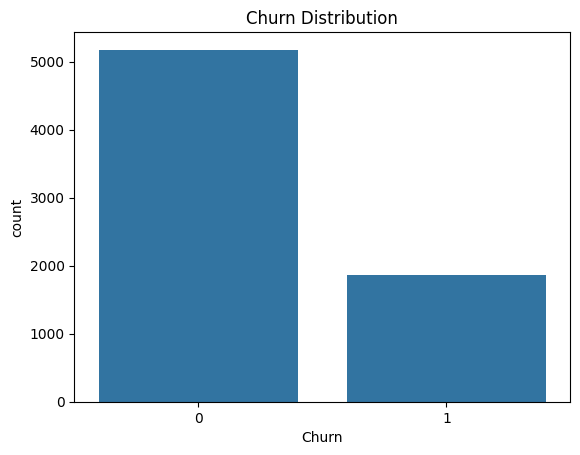
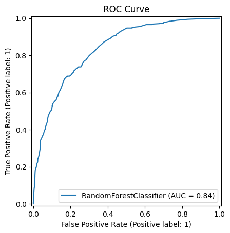

# customer-churn-predection-
Data analytics project to analyze customer  behavior and predict churn using machine learning tecniques
## Results
- Accuracy: ~80%
- ROC-AUC: ~0.69

## Insights
- Customers with lower tenure are more likely to churn
- Month-to-month customers show higher churn
## Tech Stack
- Python
- Pandas
- Scikit-learn
- Matplotlib / Seaborn
- ## Visualizations

### Churn Distribution

### Tenure vs Churn

### ROC Curve

